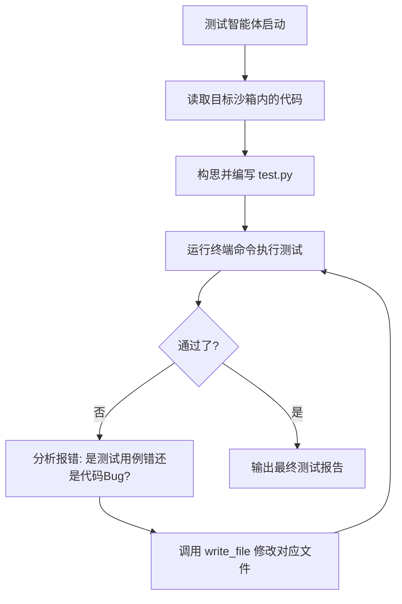

# Auto-Test Agent (自动化测试智能体) 整体规划与实现方案

## 1. 核心设计理念 (Core Concepts)
在“编码实现 (coding)”节点完成后，代码已经落盘。接下来的“测试验证 (testing)”节点不再是简单的静态代码检查，而是需要**智能体像人类 QA 工程师一样**，理解业务需求，自动编写测试脚本（如 `pytest`），并在沙箱中执行这些测试，最后出具测试报告。

核心工作流：
1. **测试方案制定**：读取 `req_data`（背景与目标）和已生成的代码结构，思考应该测哪些路径（正常路径、边界条件）。
2. **测试脚本生成**：在沙箱中生成配套的 `test_xxx.py` 文件。
3. **驱动执行**：执行类似 `pytest` 或 `python test_xxx.py` 的命令。
4. **闭环修复**：如果测试用例执行失败，分析是“测试用例写错了”还是“业务代码有 Bug”。如果是业务 Bug，调用工具直接修复业务代码，再次运行，直到测试通过。

## 2. 架构设计 (Architecture)

与 `Coder Agent` 类似，Test Agent 也是基于 ReAct 模式带有沙箱执行权限的智能体。我们将在 `backend/test_agent.py` 中实现它。

**输入依赖：**
- 需求数据 (req_data: title, goal)
- 已存在的沙箱目录 (target_project_<req_id>)
- 编码阶段生成的架构上下文

**执行循环：**

## 3. 工具与提示词设计 (Tools & Prompts)

复用 `FileSystemTools`，但 Prompt 需改变角色设定：

**System Prompt 示例:**
> 你是一个资深自动化测试工程师 (QA/SDET)。
> 你的沙箱目录里已经包含了开发人员写好的业务代码。
> 你的任务是理解需求，编写测试代码验证原业务代码是否符合预期。
> 1. 根据原代码编写详细的测试用例文件（通常是 test_main.py 或相似命名）。
> 2. 使用 run_command_tool 运行测试（可以直接用 python 运行你的测试文件）。
> 3. 如果测试不通过，你可以分析错误原因。如果是业务代码 Bug，你有权限直接修改业务代码；如果是测试代码写错，你也可以修正测试代码。
> 4. 直到测试全部通过，使用 finish 动作输出详细测试通过报告。

## 4. 实施步骤
1. **新建 `backend/test_agent.py`**：复制 `coder_agent.py` 的精髓，但将系统 Prompt 定制为 QA 视角。
2. **在 `workflow.py` 接入**：当 `stage_id == "testing"` 时，拉起 `stream_test_agent`。
3. **前端渲染兼容**：无需改变，复用 `coder_agent` 同样的 JSON 命令流输出机制，让前端实时渲染测试动作。
